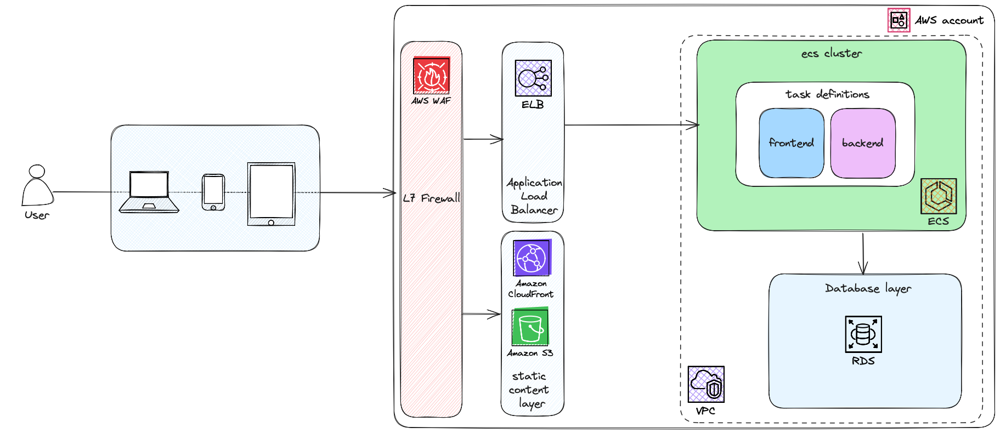

# Car Mobile Project
## Sobre
Trata-se de um aplicativo mobile Android desenvolvido no Android Studio, com o objetivo de realizar o registro e contabilidade de caronas pagas.
## Problema
Em um cenário de caronas diárias, onde o motorista cobra por viagem, ida e volta. Ao fim de uma semana, caso o motorista não cobre imediatamente após as viagens, ele se encontrará em profundo exercício mental tentando se lembrar quais dias ele forneceu a carona, se foi ida e volta, só ida, só volta… quanto lhe devem no total. Uma situação um pouco desgastante, visto que, toda semana isso se repetirá. 
## Solução
O aplicativo CarBil foi imaginado e desenvolvido justamente para aliviar as dores do motorista. Nele o motorista pode adicionar várias pessoas para quem ele presta o serviço da carona, ter um histórico de viagens e um fácil acesso do quanto te devem.
## Arquitetura
O aplicativo Carbil será hospedado no provedor de nuvem pública aws, e para tal, escolhemos uma arquitetura de 3 camadas utilizando a stack WAF, ALB, ECS e RDS.
### WAF
O WAF é indispensável para garantir a segurança da aplicação, atuando de maneira inteligente na camada 7 do modelo osi.
### ALB
Para garantir a alta disponibilidade da aplicação, se faz necessario utilizar um balanceador de carga, nesse caso, o application load balancer, que faz roteamento baseado no contexto (/user, /login, etc) 
### ECS
O serviço de gerenciamento de containers ECS é altamente disponível e permite utilizar a tecnologia de containers, totalmente gerenciada.
### RDS
Banco de dados relacional altamente disponível e gerenciável, facilmente escalável e com fácil manutenção.
### Cloudfront e s3
Solução serveless para compartilhamento de contéudo estático.
## Diagrama
